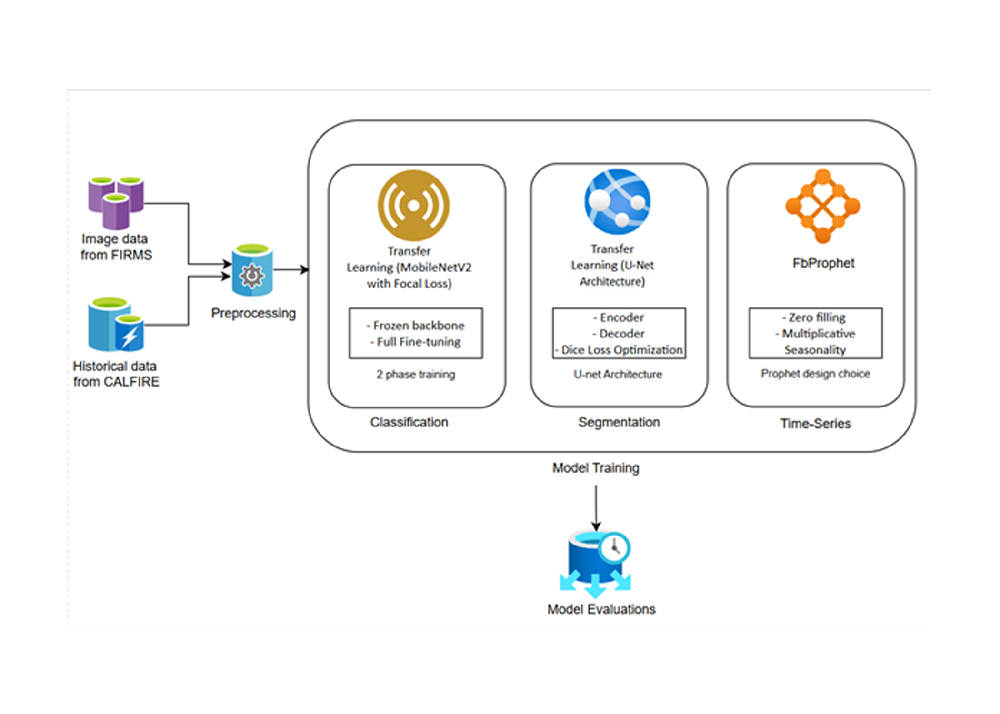

# 🔥Wildfire Detection and Forecasting System
An end-to-end machine learning pipeline for detecting wildfires in satellite imagery, mapping fire boundaries, and predicting future fire risks. Built to support emergency response teams with real-time insights.

*Classification → Segmentation → Forecasting*

---

## 📋 Table of Contents
- [Features](#-features)
- [Installation](#-installation)
- [Usage](#-usage)
- [Results](#-results)
- [Model Architectures](#-model-architectures)
- [Datasets](#-datasets)
- [Future Improvements](#-future-improvements)
- [Contributing](#-contributing)
- [License](#-license)
- [Acknowledgements](#-acknowledgements)

---

## 🚀 Features

### 1. **Fire Classification (CNN)**
- Detects fire/no-fire in satellite images using **MobileNetV2**.
- Handles class imbalance with **focal loss** and **data augmentation**.

### 2. **Fire Segmentation (U-Net)**
- Generates pixel-level fire masks with **71% IoU accuracy**.
- Uses OpenCV for color thresholding and morphological refinement.

### 3. **Risk Forecasting (Prophet)**
- Predicts daily fire counts (**MAE = 0.72**) and acres burned.
- Models seasonal trends and extreme events.

---

## 💻 Installation

1. **Clone the repository**:
   ```bash
   git clone https://github.com/bakasheddy/wildfire-detection.git
   cd wildfire-detection
2. Install dependencies:
   ```bash
   pip install -r requirements.txt
   ```
   Requirements: TensorFlow, OpenCV, Prophet, Pandas, Matplotlib.
3. Download datasets:
   - [NASA FIRMS](https://drive.google.com/drive/folders/1DNLu_gbhDI_IttUaIxU-0eGGxkgC95JU?usp=drive_link "satellite imagery")
   - [CAL FIRE](https://github.com/bakasheddy/California-satellite-imaging-wildfire-detection/blob/main/California_Fire_Perimeters_(1950%252B).csv "historical fire data")

## 🛠️ Usage

1. Classification
   ```python
   # Train the CNN model
   python train_classifier.py --data_dir=./FIRMS_Data --epochs=50

   # Predict on new images
   python infer_classification.py --image=satellite_image.png
   ```
2. Segmentation
   ```python
   # Generate fire masks
   python infer_segmentation.py --image=satellite_image.png

   # Train U-Net (requires GPU)
   python train_segmenter.py --data_dir=./FIRMS_Data --batch_size=8
   ```
3. Forecasting
   ```python
   # Generate fire risk predictions
   python run_forecast.py --data=cal_fire_data.csv --horizon=365
   ```

## 📊 Results

| Model         | Metric       | Score |
|--------------|-------------|-------|
| Classification | Accuracy    | 53%   |
| Segmentation  | IoU         | 71%   |
| Forecasting   | MAE (Fire Count) | 0.72  |

## 🤖 Model Architectures
